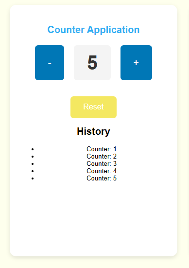
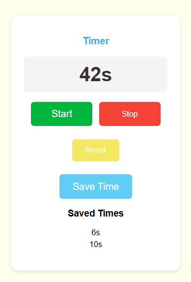
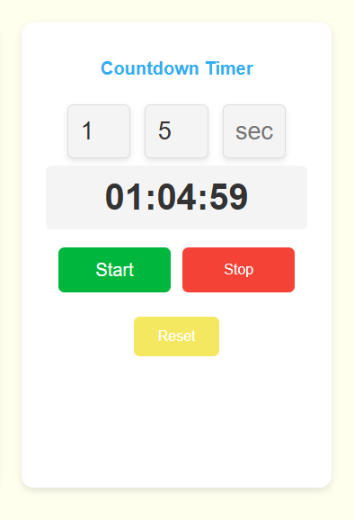

# React Timer, Counter, and Countdown Application

This project is a time management application built with React. It includes functionality for a counter, a timer, and a countdown feature.

## Features
- **Counter**: Increase, decrease, and reset the counter. The counter history is also displayed.
- **Timer**: Start, stop, and reset a timer.
- **Countdown**: Start a countdown based on the specified hours, minutes, and seconds.

## Technologies Used
- React.js
- CSS3
- HTML5
- JavaScript (ES6)

## Installation
1. Clone this repository to your local machine:
   ```bash
   git clone https://github.com/batux4n/timer-app.git
## Screenshots

Here are some screenshots of the project:




